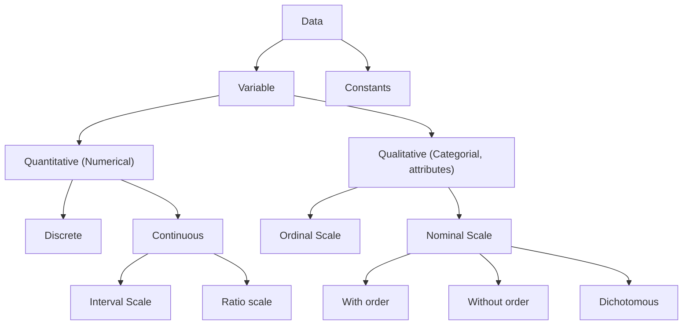

![[Statistics Formulas (Cheat sheet)]]

Statistics is a branch of mathematics that deals with:
1. Collecting Data
2. Categorizing 
3. Structuring
4. Summarizing
5. Representing
6. Analyzing --> Qualitative, Quantitative
7. Interpreting

### <font color="#4bacc6">What is Statistics?</font>

- Statistics is a <font color="#f79646">Latin word </font>`Latus`<font color="#f79646"> meaning political state.</font>
- Statistics is a <font color="#f79646">numerical value expressed in quantitative terms</font>. It is the science that deals with collection, presentation, analysis and interpretation of numerical data.
- It may also be called<font color="#f79646"> science of counting or averages.</font>
- It is a<font color="#f79646"> method of decision making in the face of uncertainty</font> on the<font color="#f79646"> basis of numerical data and calculated risks.</font>

### <font color="#4bacc6">Characteristics of Statistics</font>

1. It is an <font color="#f79646">aggregate of facts</font>.
2. It is affected by large number of causes.
3. It is always <font color="#f79646">numerically expressed.</font>
4. It should be enumerated or estimated.
5. It should be collected for a predetermined use.
6. It should be in relation to each other.
7. <font color="#f79646">All statistics are numerical statements or facts but all numerical statements that are facts are not necessarily statistics.</font>

8. There are 2 types of statistics:
	- **_Statistical Method:_** It <font color="#f79646">provides a set of statistical tools which can be statistically used</font> by different sciences in a manner in which they are deemed it.
	  Eg - social sciences, economics, psychology, engineering, etc.
	
	- **_Applied Statistics:_** It <font color="#f79646">deals with the application of statistics</font> used in various problems in an exact manner.

There are 2 types of Applied Statistics:
- **_Descriptive Applied Statistics:_** It deals with the data which is known and<font color="#f79646"> related to the future or past.</font>
  Eg - Business

- **_Scientific Applied Statistics:_** It deals with the <font color="#f79646">formulation of physical and psychological laws</font> on the basis of quantitative data collected for descriptive purposed by the use of appropriate statistical methods.

### <font color="#4bacc6">Scope</font>

1. Statistics and Economics
2. Statistics and Commerce
3. Auditing and Accounting
4. Astronomy
5. Biology
6. Research
7. Natural Sciences
8. Education
9. Computer Science
10. Mathematics

### <font color="#4bacc6">Functions</font>

1. It <font color="#f79646">simplifies</font> complete mass of data
2. It represents facts in a definite form
3. It furnishes <font color="#f79646">techniques of comparison</font>
4. It helps in formulation and testing of hypothesis
5. It guides in <font color="#f79646">formulation of policies</font>
6. It helps in forecasting of future events
7. It studies relationships
8. It helps to <font color="#f79646">make rational decisions</font>
9. It helps the government
10. It provides the<font color="#f79646"> techniques for drawing inferences</font>

### <font color="#4bacc6">Limitations</font>

1. It does not deal with individual atoms.<font color="#f79646"> It deals with quantitative data</font>
2. Statistical laws are <font color="#f79646">true only on averages</font>
3. Statistics <font color="#f79646">does not reveal the entire story</font>
4. Statistics is <font color="#f79646">liable to be misused</font>
5. Statistical data <font color="#f79646">should be uniform</font> and homogeneous

---

## <font color="#4bacc6">What is Data?</font>

- <font color="#f79646">Data is a collection of facts</font>
- Based on collection of data, it is divided into 2 types: **Primary** and **Secondary**
- According to its characteristics, it has 2 types: 
	- **Time series** (depends on time)
	- **Cross-sectiona**l (time is fixed)

### <font color="#4bacc6">Types of data</font>

- **Constants** - Value doesn't change
- **Variables** - Value (characteristics / value of interest) changes 




| <font color="#9bbb59">NOIR</font> | <font color="#9bbb59">Category Name</font> | <font color="#9bbb59">Meaningful Order</font> | <font color="#9bbb59">Equal Distance</font> | <font color="#9bbb59">True Zero and Ratio</font> |
| --------------------------------- | ------------------------------------------ | --------------------------------------------- | ------------------------------------------- | ------------------------------------------------ |
| Nominal                           | Yes                                        |                                               |                                             |                                                  |
| Ordinal                           | Yes                                        | Yes                                           |                                             |                                                  |
| Interval                          | Yes                                        | Yes                                           | Yes                                         |                                                  |
| Ratio                             | Yes                                        | Yes                                           | Yes                                         | Yes                                              |


## Diagrammatic Representation of Data

### Bar diagram


| Year | Sales (in Cr) |
| ---- | ------------- |
| 2000 | 10            |
| 2001 | 15            |
| 2002 | 25            |
| 2003 | 5             |
```chart
type: bar
labels: [2000,2001,2002,2003]
series:
  - title: Sales (in Cr)
    data: [10,15,25,5]
width: 80%
beginAtZero: true
```


### Multiple Bar Diagram

```sheet


| Zone  | Rain (in cm) | <    | <    |
| ----- | ------------ | ---- | ---- |
|       | 2001         | 2002 | 2003 |
| North | 10           | 15   | 20   |
| West  | 5            | 10   | 15   |
| East  | 20           | 10   | 15   |
| South | 5            | 15   | 10   |

```


```chart
type: bar
labels: [North, West, East, South]
series:
  - title: 2000
	data: [10, 5, 20, 5]
	
  - title: 2001
	data: [15, 10, 10, 15]
	
  - title: 2002
    data: [20, 15, 15, 10] 
width: 100%
beginAtZero: true
```


### Compound / Stacked Bar Diagram

Referring to the table in [[#Multiple Bar Diagram|Rainfall table]] for data.

```chart
type: bar
labels: [North, West, East, South]
series:
  - title: 2000
	data: [10, 5, 20, 5]
	
  - title: 2001
	data: [15, 10, 10, 15]
	
  - title: 2002
    data: [20, 15, 15, 10] 
width: 100%
beginAtZero: true
stacked: true
```

### Percentage Bar Diagram

A percentage bar diagram is similar to the [[#Compound / Stacked Bar Diagram]], but the values are displayed in percentages, and the max height is capped at 100%.


### Pie Diagram

| Region | Sales (in Cr) |
| ------ | ------------- |
| N      | 45            |
| W      | 30            |
| E      | 45            |
| S      | 30            |

```chart
type: pie
labels: [N,W,E,S]
series:
  - title: Sales (in Cr)
    data: [45,30,45,30]
    backgroundColor: ["#FF6384", "#36A2EB", "#FFCE56", "#4BC0C0"]
width: 50%
beginAtZero: true
```


